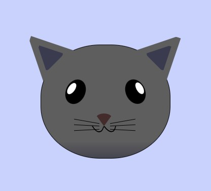

# Topics covered:

1. ## position

   **static**: static is the default positioning for all elements. If you assign it to an element, you won't be able to move it around with top, right, left, or bottom.

   **relative**: When you use the relative value, the element is still positioned according to the normal flow of the document, but the top, left, bottom, and right values become active.

   **absolute**: When you use the absolute value for your position property, the element is taken out of the normal flow of the document, and then its position is determined by the top, right, bottom, and left properties.

   **fixed**: is a position property value that lets you make an element fixed to the page no matter where the user scrolls to on the page.

   **sticky**: positioning is a hybrid of relative and fixed positioning. It allows an element to stick to a specific position within its containing element or viewport, based on the scroll position.

2. ## border-top-left-radius, border-top-right-radius
3. ## transform //translate(), rotate(), scale(), skew(), and matrix()
4. ## z-index
5. ## create triangle using css

