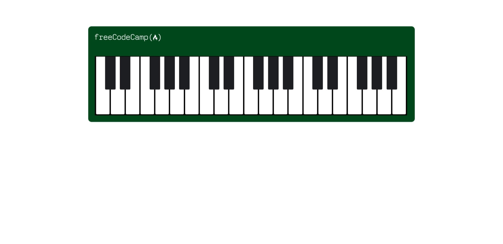

# Topics covered:

1. ::before, ::after //create pseudo-elements for the element, mostly for cosmetics
2. position //specifies the type of positioning method used for an element (static, relative, fixed, absolute or sticky)
3. float //used for positioning and formatting content e.g. let an image float left to the text in a container.
4. content //used to set or override the content of the element
5. top, left //position item relating to immediate ancestor

## Responsive design with screen sizes 768px, 769px - 1199px(small laptops), and above that.

